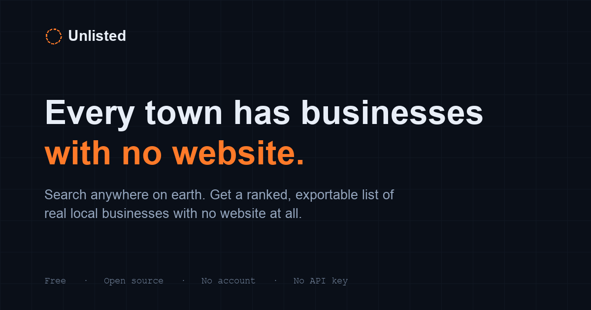

# Unlisted

**Find local businesses with no website — free, open source, no signup.**

Search any town on earth and get a ranked, exportable list of real local
businesses with no website at all — the shortest cold-outreach list in web
design. Built for freelance web designers, agencies, and anyone doing local
lead generation.



[](LICENSE)


**Live demo: add your deployed URL here once published · No account · No API key · No backend**

## What it is

A single static page. Type a town name and it:

1. Geocodes the place via [Nominatim](https://nominatim.openstreetmap.org/) (OpenStreetMap's own geocoder)
2. Queries [Overpass API](https://overpass-api.de/) for every mapped shop, restaurant, trade, clinic, salon, and office in that area
3. Filters out national chains (detected via OSM `brand`/`operator` tags — a franchise's website tag is usually empty even though the brand obviously has one)
4. Scores and ranks what's left by how reachable the business is and how large its web-presence gap is
5. Exports to CSV

Everything runs in the visitor's own browser. There is nothing to host except
three static files, and nothing to pay for — both APIs are free, public, and
CORS-open.

## Who it's for

Web designers, freelancers, and agencies looking for real prospects: a
business with no website is the single strongest cold-outreach opener there
is. [~27% of US small businesses have no website as of 2026](https://www.zippia.com/advice/small-business-website-statistics/),
and businesses with one earn meaningfully more revenue than those without.

## Honesty contract

- Every business shown came from a real OpenStreetMap query, not a
  generated or scraped list.
- "No website" means *no website tag in OpenStreetMap* — usually true,
  occasionally just an unmapped detail. The tool says exactly that, in the
  UI, rather than implying more certainty than the data supports. Confirm
  with one phone call before pitching.
- Chain filtering is heuristic (based on OSM tags), not perfect. The
  "Include chains" checkbox always exists so nothing is hidden from you.

## Running it locally

No build step, no dependencies.

```bash
cd unlisted
python3 -m http.server 8000
```

Open `http://localhost:8000`.

## Monetizing

This is a free tool by design — no paywall, no signup, that's the whole
value proposition for people finding it via search or a link. Realistic
revenue paths that don't compromise that:

1. **A tip jar.** [Ko-fi](https://ko-fi.com) takes 0% on one-off tips (vs
   Buy Me a Coffee's 5%), and supporters don't need an account to send one —
   only the *creator* does. `index.html` has a hidden `#supportLink` in the
   footer, ready to un-hide once that link exists.
2. **The tool as a portfolio piece / lead magnet for freelance work**, not
   a product in itself — "I built the tool you're using right now" is a
   strong opening line in outreach to the exact businesses it surfaces.
3. **Traffic-driven, later**: if it ranks for searches like "find local
   businesses without a website," a simple non-intrusive ad slot or a
   sponsor line becomes viable once there's real usage data to show.

None of this requires a backend or a schema change — it's additive to the
static page whenever you're ready.

### What only you can do (account creation is off-limits for the assistant)
- Create the Ko-fi account and get your real tip-jar link
- Pick and set up a deploy target (Cloudflare Pages / Netlify / GitHub Pages)
  — see below
- Register a domain, if you want one nicer than `*.pages.dev`

## Deploying

Any static host works. Drag-and-drop options that need no CLI:

- **[Cloudflare Pages](https://pages.cloudflare.com/)** — free, drag the `unlisted/` folder in
- **[Netlify Drop](https://app.netlify.com/drop)** — free, same idea, no account needed for a one-off deploy
- **GitHub Pages** — push this folder to a repo, enable Pages in Settings

There is no server-side config, no environment variables, and no secrets to
set. If you fork this and see meaningful traffic, consider pointing
`OVERPASS_ENDPOINTS` in `app.js` at your own Overpass instance (or a paid one)
rather than leaning on the free public mirrors — see the note at the top of
that file.

### After you deploy: 3 placeholders to fill in

`index.html` ships with honest placeholders instead of a guessed live URL —
find and replace once you know your real address:

1. `https://YOUR-DOMAIN-HERE/` (4 occurrences — canonical link, Open Graph
   and Twitter meta tags) → your real deployed URL
2. `href="https://github.com"` on the `#repoLink` "Source" link in the header
   → your real repo URL
3. (optional) the JSON-LD block's `description` if you change the pitch

```bash
sed -i '' 's|https://YOUR-DOMAIN-HERE/|https://your-real-domain.com/|g' index.html
```

## Rate limits and etiquette

Nominatim and Overpass are volunteer-funded public infrastructure, not this
project's servers. `app.js` is written to be a good citizen of both:

- Geocode and query results are cached in the visitor's own `localStorage`
  for a week, so repeat searches don't re-hit the network.
- A minimum gap is enforced between searches from the same browser.
- Every request sends an honest, identifying `User-Agent`.
- If you're embedding this at scale (thousands of daily searches), read
  [Nominatim's usage policy](https://operations.osmfoundation.org/policies/nominatim/)
  and [Overpass's](https://wiki.openstreetmap.org/wiki/Overpass_API#Public_Overpass_API_instances)
  before you do, and consider running your own instance.

## Data & licensing

Business data is © [OpenStreetMap contributors](https://www.openstreetmap.org/copyright),
available under the [Open Database License](https://opendatacommons.org/licenses/odbl/) (ODbL).
This code is MIT licensed — see [LICENSE](LICENSE).

## Files

```
unlisted/
├── index.html    structure, content, SEO/social meta tags
├── styles.css    theme (dark, cartographic — deliberately not the usual AI-tool blue/purple)
├── app.js        geocoding, querying, scoring, rendering, CSV export
├── og-card.png   1200×630 social share image
├── LICENSE
└── README.md
```

Three files of actual app code, no dependencies, no framework. Anyone can
fork this in five minutes and re-theme it for their own niche.

## Discoverability (for maintainers)

If you're publishing your own fork on GitHub, two things help people actually
find it that a README alone can't do:

- **Repo topics** — add some via the GitHub UI (repo page → gear icon next to
  "About") or the CLI:
  ```bash
  gh repo edit --add-topic web-development,lead-generation,openstreetmap,local-seo,freelance,web-design,no-code,javascript,static-site
  ```
- **Repo description & URL** — fill in the "About" panel on the repo page
  with a one-line pitch and your deployed URL; GitHub surfaces both in search
  and in topic listings.
